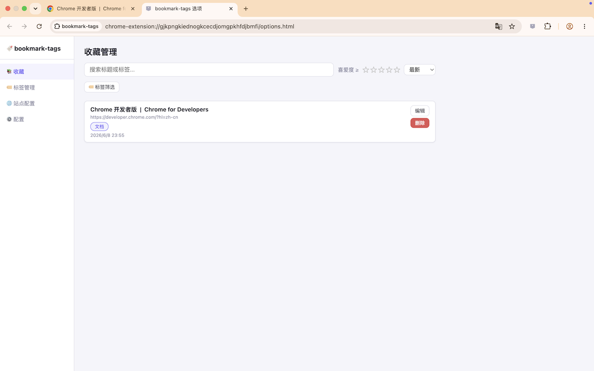
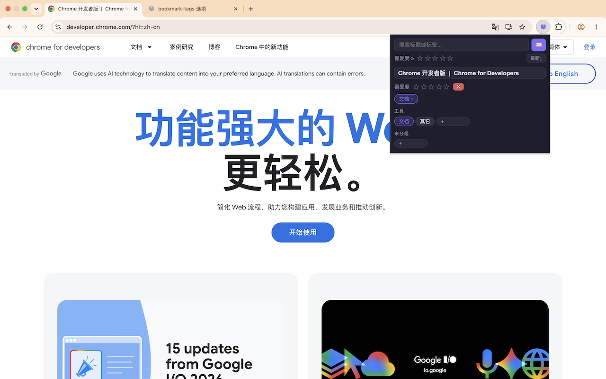
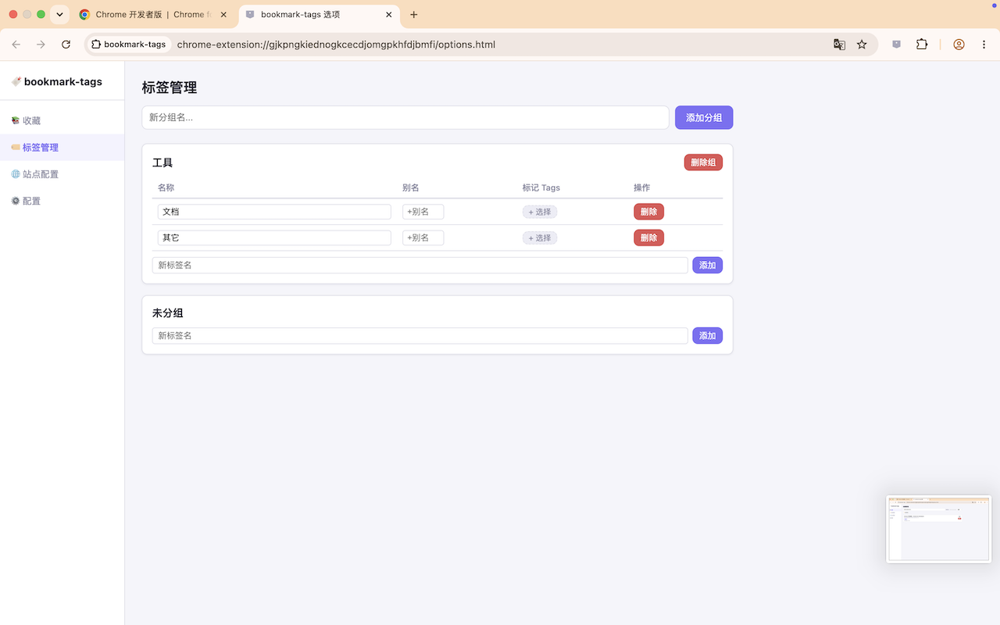

# bookmark-tags

**简体中文** | [English](README.md)

Chrome 书签管理插件 — 支持标签分组、喜爱度评分、站点内容提取与 Google 云端同步。

[**➜ 从 Chrome 应用商店安装**](https://chromewebstore.google.com/detail/bookmark-tags/pljamlkjekmanbdoabecjpbiickpohkj)

## 截图

| 收藏管理 | 弹窗 |
|---|---|
|  |  |

**标签管理**



## 安装

**方式一：Chrome 应用商店（推荐）**

直接前往 [Chrome 应用商店页面](https://chromewebstore.google.com/detail/bookmark-tags/pljamlkjekmanbdoabecjpbiickpohkj) 点击「添加至 Chrome」。

**方式二：从源码加载**

1. 打开 Chrome，访问 `chrome://extensions/`
2. 开启「开发者模式」
3. 点击「加载已解压的扩展程序」，选择本项目根目录

## 功能

### Popup 弹窗
- **已收藏页面**：图标高亮（紫色），显示已打标签和喜爱度，点击标签查看关联书签
- **未收藏页面**：图标灰色，显示最近使用/推荐标签，快速收藏
- **站点脚本自动填充**：未收藏页面自动提取 title/preview/previewVideo，建议 tag（点击后创建）
- **标题可编辑**：收藏和未收藏状态的标题都可以直接修改
- **搜索**：支持标题+标签关键词搜索（含 alias 和标记 tags），标签多选（OR），喜爱度筛选（>=），三者 AND 逻辑
- **分组标签**：每个分组（含未分组）底部可添加新标签，点击标签直接添加/移除
- **快捷标签**：标记为「快捷」的标签会显示在搜索框下方，点击一下即按该标签搜索
- **标签链接**：配了链接的标签，chip 上会显示 🔗，点击直接跳转（不会误触打标签）
- **Tag Picker**：在添加标签输入框 focus 时弹出完整分组标签选择器，搜索+点击

### Options 管理页
1. **收藏管理**：全宽布局，支持列表/平铺模式切换，preview 默认显示，hover 播放视频，卡片大小可调
2. **标签管理**：未分组始终显示；别名和标记 Tags 在搜索中生效；标记 Tags 用 tag picker 选择。每行的「编辑」按钮会打开一个弹窗，配置三个标签级选项：**跳转链接**（配好后该行显示 🔗）、**⚡ 快捷标签**（显示在搜索框下方）、**🏠 首页展示**（作为新标签页的数据源）
3. **站点配置**：URL 正则匹配 + 自定义脚本（可读写 title/labels/tags/preview/previewVideo），内置 Debug 测试
4. **配置**：主题与语言偏好；数据导出/导入/清除；Chrome 同步 + Google Drive 版本化同步
5. **使用说明**：内置 Guide 页面，覆盖标签管理、站点配置、预览视频、数据同步

### 首页
- 以卡片网格**随机展示**所有标记为 🏠 的标签下的收藏；从「配置 → 首页」或 popup 里的 🏠 按钮打开
- 每次打开都重新采样；点「换一批」可不刷新再采一次
- **刻意不声明** `chrome_url_overrides.newtab`：Chrome 没有运行时开关新标签页覆盖的接口，而常见绕法（重定向到 `chrome-search://local-ntp/…`）是个未公开的内部 URL，且新版 Chrome 已有失效报告。新标签页保持浏览器默认
- 三种显示方式——**卡片**、**卡片+预览**、**列表**——在页头切换。选择存在 `bt_config.homeDisplay`，因此会被记住，并随 Chrome 同步 / Google Drive 一起走
- 预览模式会显示收藏的 `preview` 图；有 `previewVideo` 时**悬停即播放**（静音循环）。勾选「自动播放视频」则全部直接播放；该开关存为 `bt_config.homeAutoplay`
- 纯读取：打开新标签页不会写入任何数据，因此不会产生同步抖动
- 区分两种空状态：「还没有标签被标记为 🏠」（并给出进入标签管理的快捷入口）与「首页标签下还没有收藏」

### 主题
- popup 与 options 共用同一套配色，支持 **跟随系统（默认）/ 浅色 / 深色**，在 Options → Settings → Theme 中切换
- 跟随系统时不写 `data-theme` 属性，由 CSS `light-dark()` + `color-scheme` 原生响应系统外观变化，**无需刷新页面**
- 主题偏好存于 `bt_config.theme`，随 Chrome 同步 / Google Drive 一起同步
- 首屏由 `theme.js` 从 `localStorage` 缓存同步应用，避免加载瞬间闪烁

> ⚠️ 需要 Chrome 123+（`light-dark()` 支持）。另外注意：popup 此前固定为深色，改为跟随系统后，系统为浅色时 popup 会显示为浅色。

## 快速上手

1. 安装后在任意页面点击扩展图标，看到推荐标签点击即可收藏
2. 进入 Options → Tag Manager，创建分组和标签来组织书签
3. 进入 Options → Site Config，配置常用网站的自动提取脚本
4. 详见 Options → 📖 Guide

## 数据模型

| 模型 | 字段 |
|------|------|
| Bookmark | id, url, title, tags[], favorite(0-5), labels[], contentTags[], preview, previewVideo, createdAt, updatedAt |
| TagGroup | id, name, order |
| Tag | id, name, alias[], tags[]（其他 tagId）, groupId, order, link, quick, home |
| SiteConfig | id, urlPattern, script, updatedAt |
| Config | syncEnabled, lastSyncAt, gdAutoSync, gdBaseVersion, gdDeviceId, gdDirty, locale, theme |

Tag 上这三个可选字段**不会**在读取时回填：改动前创建的标签就是 `undefined`，各处消费方一律按 `''` / `false` 处理。若在 `listTags()` 里补默认值，每个老标签都会和它同步到云端的副本产生差异，从而被登记为一次性冲突。`link` 在写入时会过一遍 http(s)/ftp 白名单，因此存储中的值总是可以安全地交给 `chrome.tabs.create`。

## 搜索逻辑

- **alias**：搜索 tag 的别名等同于搜索原名，popup 和 options 均生效
- **标记 Tags**：搜索 tag1 时，如果 tag1 被标记了 tag2，搜索 tag1 也能命中打 tag2 的页面
- 搜索 tagIds 会被展开（alias + 标记关联递归展开）

## 站点脚本

站点配置的 `script` 字段可直接读写以下预定义变量：
- `title` — 页面标题
- `labels` — 标签数组（字符串）
- `tags` — 标签数组（字符串，未收藏时点击创建）
- `preview` — 预览图 URL
- `previewVideo` — 预览视频 URL

示例：
```js
// URL Pattern: youtube\.com/watch
title = document.querySelector('yt-formatted-string.ytd-watch-metadata')?.textContent?.trim() || title;
preview = document.querySelector('link[rel="thumbnail"]')?.href || '';
previewVideo = location.href;
```

## 同步

- **Chrome Sync**：通过 chrome.storage.sync 在设备间同步，上限约 100KB
- **Google Drive**：版本化同步到 Google Drive appDataFolder，支持冲突检测和解决

## 许可

[MIT](LICENSE) © 2026 21emerald
